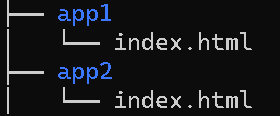
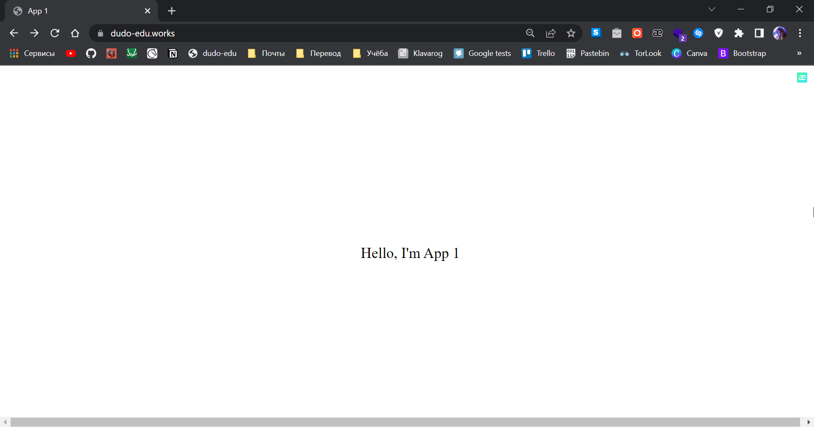
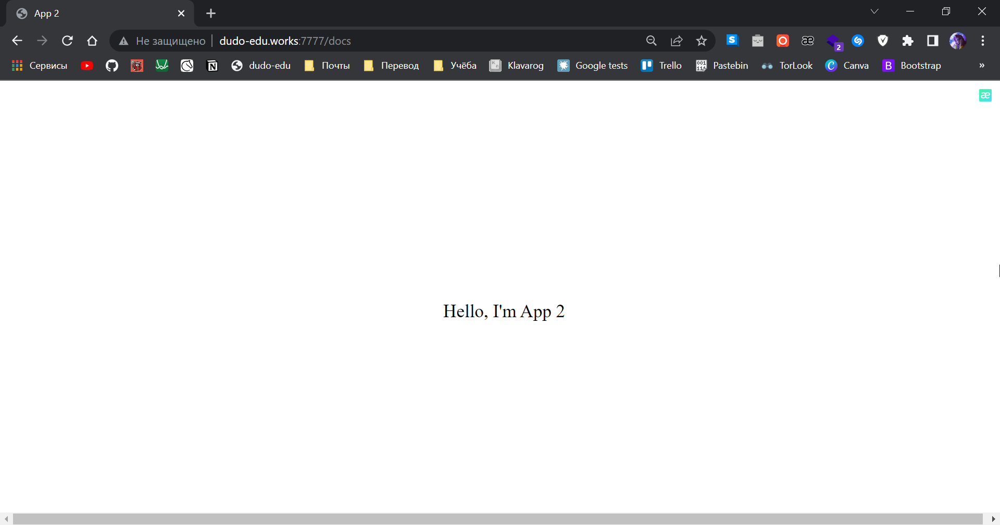

# Lab-3
## Задание
Реализовать два приложения, располагающиеся на файловой системе в */var/www/html/app1/index.html* и  */var/www/html/app2/index.html*, доступные по адресам http://ip/ и http://ip:7777/docs/ соответственно с помощью конфигурирования NGINX.

## Ход работы
### Создадим все необходимые файлы и директории на сервере

### Конфигурация файла default в sites-enabled
**Настройка сервера для app1:**
```
server {
        #listen 443 ssl http2 default_server;
        ssl_certificate /etc/ssl/dudo-edu.works_crt.crt;
        ssl_certificate_key /etc/ssl/dudo-edu.works.key;

        listen 443 ssl default_server;
        listen [::]:443 ssl default_server;

        root /var/www/html;

        index index.html index.htm index.nginx-	debian.html index.php;

        server_name _;

        location / {
                try_files $uri $uri/ =404;
                alias /var/www/html/app1/;
        }
		
		        location ~* \.(jpg|jpeg|gif|png|css|js|ico|xml)$ {
            expires 1d;
        }

}
		
```
**Настройка сервера для app2:**
```
server {
        listen 7777 default_server;
        listen [::]:7777 default_server;

        server_name _;

        root /var/www/html/app2;
        index index.html;

        location / {
                return 418;
        }

        location /docs {
                try_files $uri /index.html =404;
        }
}
```
### Сами сайты
#### App 1

#### App 2
